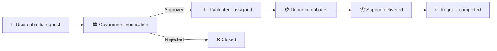

<div align="center">

# 🏠 Homeless Help Hub
### Smart Welfare Coordination Platform with Role-Based Access Control

[](https://homelesshelphub.infinityfree.me/)
[](https://php.net)
[](https://mysql.com)
[](https://tailwindcss.com)
[](LICENSE)

**A production-grade full-stack platform connecting vulnerable communities with volunteers, donors, and government authorities through verified support workflows.**

[🔍 Problem](#-problem-statement) • [⚙ Workflow](#-request-workflow) • [🏗 Architecture](#-system-architecture) • [🚀 Quick Overview](#-key-features)

---

</div>

## ✦ Problem Statement

In welfare systems, help often fails to reach people because of:

| Problem | Impact |
|---------|--------|
| Fake requests | Resources are misused |
| Manual verification | Slow approvals |
| Poor coordination | Delayed assistance |
| Lack of transparency | Donor trust decreases |

This leads to **inefficient and unreliable support delivery**.

Homeless Help Hub solves this by creating a **structured multi-role workflow** where every request is verified, assigned, tracked, and completed transparently.

---

## ✦ What This Platform Solves

The platform creates a verified workflow:

```text
User Request
    ↓
Government Verification
    ↓
Volunteer Assignment
    ↓
Donor Contribution
    ↓
Support Delivery
```

Each step ensures:
- Identity verification  
- Role-based accountability  
- Transparent progress tracking  
- Faster support delivery  

---

## ✦ Key Features

### 👤 User Dashboard
- Submit verified help requests
- Upload proof / documents
- Track request status
- View assigned volunteer details

### 🧑‍🤝‍🧑 Volunteer Dashboard
- Browse approved requests
- Accept assignments
- Update request progress
- Mark completion status

### 🏛 Government Officer Dashboard
- Verify submitted proof
- Approve / reject requests
- Assign volunteers region-wise
- Monitor workflow accountability

### 💳 Donor Dashboard
- Donate to verified requests
- View donation history
- Track impact and request progress

---

## ✦ Request Workflow



---

## ✦ Core Architecture

```text
┌───────────────────────────┐
│ Frontend UI               │
│ HTML • Tailwind • Bootstrap│
└──────────────┬────────────┘
               │
               ▼
┌───────────────────────────┐
│ PHP Backend Logic         │
│ Auth • Routing • Workflow │
└──────────────┬────────────┘
               │
               ▼
┌───────────────────────────┐
│ Role Access Layer         │
│ User / Volunteer / Donor  │
│ Government Officer        │
└──────────────┬────────────┘
               │
               ▼
┌───────────────────────────┐
│ MySQL Database            │
│ Requests • Users • Status │
└───────────────────────────┘
```

---

## ✦ System Design

This platform uses **Role-Based Access Control (RBAC)**.

Supported roles:

| Role | Responsibility |
|------|----------------|
| User | Raise support requests |
| Volunteer | Provide assistance |
| Donor | Financial contribution |
| Government Officer | Verification & approval |

This ensures secure access and controlled workflow execution.

---

## ✦ Tech Stack

<div align="center">

| Layer | Technology |
|-------|------------|
| Frontend | HTML5 · Tailwind CSS · Bootstrap |
| Backend | PHP |
| Database | MySQL |
| Concepts | RBAC · Approval Workflow · Assignment Engine |

</div>

---

## ✦ Project Structure

```bash
Homeless_HelpHub/
├── index.html
├── auth.php
├── db.php
├── login.php
├── logout.php
├── submit_request.php
├── edit_request.php
├── approve_request.php
├── assign_request.php
├── update_assignment.php
├── donate_request.php
├── add_feedback.php
├── user_dashboard.php
├── volunteer_dashboard.php
├── donor_dashboard.php
└── gov_dashboard.php
```

---

## ✦ Future Improvements

- [ ] Payment gateway integration  
- [ ] Real-time notifications  
- [ ] Geo-location support  
- [ ] AI fraud detection  
- [ ] Mobile application  
- [ ] Admin analytics dashboard  

---

## ✦ Real-World Use Cases

This architecture can scale for:

- NGO operations  
- Disaster relief systems  
- Rural welfare programs  
- Government aid distribution  
- Community support networks  

---

## ✦ Creator

<div align="center">

### Arun Chandrasekar

Integrated M.Tech Software Engineering — VIT Vellore

[](https://arunc.vercel.app)
[](https://github.com/ArunChandrasekar07)
[](https://linkedin.com/in/arunchandrasekar1)

*Built to create social impact through technology.*

</div>
