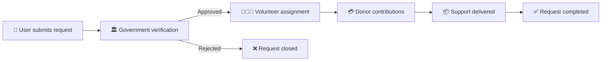

<div align="center">

# 🏠 Homeless Help Hub
### Connecting People in Need with People Who Can Help

**A role-based full-stack platform enabling verified support requests, volunteer coordination, transparent donations, and government oversight.**

<br/>

[](https://homelesshelphub.infinityfree.me/)
[](https://php.net)
[](https://mysql.com)
[](LICENSE)

</div>

---

## ✦ What is Homeless Help Hub?

Homeless Help Hub is a **secure role-based web application** built to bridge the gap between vulnerable individuals and support systems.

The platform ensures that help requests are:
- Verified by authorities  
- Assigned to volunteers  
- Supported by donors  
- Tracked transparently end-to-end  

Unlike generic donation platforms, this system adds **government verification and structured accountability**.

---

## ✦ Problem Statement

In real-world welfare systems, help distribution often suffers from:

| Problem | Impact |
|---|---|
| Fake requests | Resources wasted |
| Poor coordination | Delayed support |
| No transparency | Donors lose trust |
| Weak accountability | Requests unresolved |

Homeless Help Hub solves this with a **multi-role approval workflow**.

---

## ✦ Core Roles

<table>
<tr>
<td width="50%" valign="top">

### 👤 User
- Submit support requests  
- Upload proof / identity  
- Track approval status  
- View assigned volunteer  

### 🧑‍🤝‍🧑 Volunteer
- Browse approved requests  
- Accept assignments  
- Provide updates  
- Mark completion  

</td>
<td width="50%" valign="top">

### 🏛 Government Officer
- Verify identity proof  
- Approve / reject requests  
- Assign volunteers  
- Monitor workflow  

### 💳 Donor
- Donate to verified requests  
- Track donations  
- Monitor impact  

</td>
</tr>
</table>

---

## ✦ Key Features

### 🔐 Role-Based Authentication
Separate secure access for:
- Users
- Volunteers
- Donors
- Government Officers

### 📋 Request Management
Users can submit verified support requests with documentation.

### ✅ Approval Workflow
Government officers validate requests before public visibility.

### 🤝 Volunteer Assignment
Approved requests are assigned to volunteers for execution.

### 💰 Transparent Donation Flow
Donors contribute to verified requests only.

### 📈 Real-Time Status Tracking
Every stakeholder can monitor request progress.

---

## ✦ Workflow



---

## ✦ System Architecture

```text
Frontend (HTML + Tailwind + Bootstrap)
                │
                ▼
         PHP Backend Logic
                │
                ▼
      Role-Based Access Control
                │
                ▼
        MySQL Relational DB
```

---

## ✦ Tech Stack

| Layer | Technology |
|---|---|
| Frontend | HTML5, Tailwind CSS, Bootstrap |
| Backend | PHP |
| Database | MySQL |
| Concepts | RBAC, Approval Workflow, Task Assignment |

---

## ✦ Project Structure

```bash
Homeless_HelpHub/
├── index.html
├── auth.php
├── db.php
├── login.php
├── logout.php
├── submit_request.php
├── edit_request.php
├── approve_request.php
├── assign_request.php
├── update_assignment.php
├── donate_request.php
├── add_feedback.php
├── user_dashboard.php
├── volunteer_dashboard.php
├── donor_dashboard.php
└── gov_dashboard.php
```

---

## ✦ Database Modules

Main system entities:

- Users  
- Volunteers  
- Donors  
- Government Officers  
- Help Requests  
- Assignments  
- Donations  
- Feedback  

These entities ensure structured workflow and accountability.

---

## ✦ Future Improvements

- [ ] Payment gateway integration  
- [ ] Live notifications  
- [ ] AI-based fraud detection  
- [ ] Geo-location support  
- [ ] Mobile application  
- [ ] Analytics dashboard  

---

## ✦ Use Cases

This platform can be adapted for:

- Disaster relief
- NGO coordination
- Rural welfare systems
- Government social assistance
- Community support programs

---

## ✦ Creator

<div align="center">

### Arun Chandrasekar

Integrated M.Tech Software Engineering — VIT Vellore

[](https://arunc.vercel.app)
[](https://github.com/ArunChandrasekar07)
[](https://linkedin.com/in/arunchandrasekar1)

</div>

---

<div align="center">

**Built to create impact through technology.**

Helping people reach help faster, safer, and transparently.

</div>
